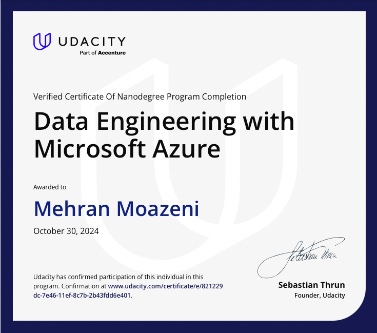

# Data Engineering with Microsoft Azure - Udacity Nanodegree

This repository contains projects completed as part of the **Data Engineering with Microsoft Azure** Nanodegree on Udacity. This program focused on applying Azure-based data engineering skills to real-world scenarios, covering essential topics like data modeling, NoSQL databases, ETL (Extract, Transform, Load) processes, and data pipeline automation with Azure services.

## Table of Contents :mortar_board: :books:

- [Project Overview](#project-overview) :rocket:
- [Skills and Tools](#skills-and-tools) :hammer_and_wrench:
- [Course Structure](#course-structure)
- [Projects](#projects) :floppy_disk: :construction_worker:
- [Usage](#usage)
- [Contributing](#contributing)
- [License](#license)

---

## Project Overview :blue_book:

This repository contains several projects developed to demonstrate key data engineering concepts and Azure technologies. The projects are designed to build expertise in:

- Creating and optimizing data models
- Working with NoSQL databases using Cassandra
- Developing ETL pipelines and workflows using Azure Data Factory
- Analyzing data with Azure Synapse Analytics
- Managing and automating data flows across various Azure services
- SQL-based data manipulation and transformation

### Each project folder contains:

- Project-specific documentation
- Source code
- Configuration files
- Instructions for replicating the environment and workflows

## Skills and Tools :toolbox:

The course and projects helped build skills with the following tools and technologies:

- **Data Modeling**: Database schema design, optimization for analytical or transactional use.
- **Azure Data Factory (ADF)**: Orchestrating ETL pipelines, automation, and scheduling.
- **Azure Synapse Analytics**: Data warehousing, big data analytics, and querying large datasets.
- **NoSQL Database (Cassandra)**: Working with non-relational databases for scalable data storage.
- **SQL**: Querying, transforming, and managing data.
- **Python**: Writing custom ETL logic, data transformation scripts.
- **Data Flows**: Visual data transformations and data orchestration.

---

## Course Structure :bookmark_tabs:

The course was structured into key sections, each with projects designed to reinforce the specific skills taught. Here is a breakdown of each course module:

### Data Modeling and Ingestion :wrench:
- **Key Topics**: Data modeling fundamentals, database schema design, data ingestion strategies.
- **Tools**: Azure SQL Database, Azure Synapse Analytics, Data Factory.

### NoSQL Databases with Cassandra
- **Key Topics**: NoSQL principles, Cassandra data modeling, query optimization.
- **Tools**: Cassandra, Python.

### Azure Data Factory for ETL Pipelines
- **Key Topics**: Building ETL pipelines, data transformation, automation.
- **Tools**: Azure Data Factory, Data Flows, JSON-based configuration.

### Data Warehousing with Azure Synapse Analytics
- **Key Topics**: Data warehousing, query optimization, distributed computing in Synapse.
- **Tools**: Azure Synapse Analytics, SQL, Synapse Studio.

### Advanced Data Engineering and Automation
- **Key Topics**: Complex data flows, automation, and monitoring in Azure.
- **Tools**: Azure Data Factory, Azure Logic Apps, PowerShell, SQL.

---

## Projects :floppy_disk: :construction_worker:

### Project 1: Data Modeling and ETL Pipeline with Azure SQL Database
- **Objective**: Develop a database schema and ETL pipeline for a retail data use case.
- **Technologies**: Azure SQL Database, Azure Data Factory, SQL, Python.

### Project 2: Building a NoSQL Database with Cassandra
- **Objective**: Design a NoSQL data model for a streaming service and implement it in Cassandra.
- **Technologies**: Cassandra, Python.

### Project 3: Data Warehousing and Analytics with Azure Synapse :construction_worker:
- **Objective**: Create a data warehouse and perform analytics using Azure Synapse.
- **Technologies**: Azure Synapse Analytics, SQL.

Each project folder includes detailed instructions and example code to help you replicate the project.

---

## Usage :wrench:

Each project has its own `README` file with specific instructions on usage, running pipelines, and testing the outcomes.

1. Configure Azure services (e.g., set up Azure Data Factory, Synapse, SQL Database) as described in the project documentation.
2. Run ETL pipelines or scripts, following instructions in each project folder.
3. Monitor results via Azure Portal or relevant tools (e.g., Synapse Studio for data warehousing projects).

---

## Contributing :raised_hands:

This repository is intended as a personal portfolio, but feedback and suggestions are welcome! If you'd like to make improvements, please feel free to fork the repository and submit a pull request.

---

## License :scroll:

This project is licensed under the MIT License. 